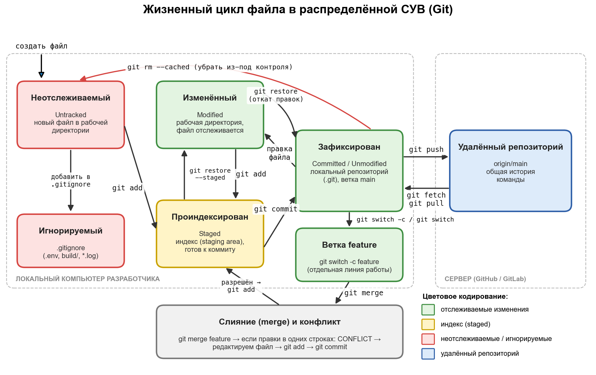

# Отчёт по лабораторному практикуму № 1

**Дисциплина:** Системы управления версиями  
**Тема:** Введение в системы управления версиями. Основные понятия и назначение  
**Выполнил:** Осипов Даниил Сергеевич  
**Преподаватель:** Дмитриев Д.В.

> 1. Титульный лист — в файле [СУВ_ЛП1_Отчёт.docx](СУВ_ЛП1_Отчёт.docx) (PDF-версия: [СУВ_ЛП1_Отчёт.pdf](СУВ_ЛП1_Отчёт.pdf)).

## 2. Цель работы

Сформировать устойчивое представление о назначении, базовых понятиях и сферах применения систем управления версиями (СУВ) и применить полученные знания в контексте профессиональной деятельности магистра прикладной информатики.

Задачи работы:

- закрепить понятийный аппарат: версия, ревизия, репозиторий, коммит, ветка, тег, слияние, конфликт;
- проанализировать структуру реальных ИТ-проектов, использующих СУВ;
- визуализировать жизненный цикл файла в распределённой СУВ (Git);
- подготовить отчёт по лабораторному практикуму.

## 3. Глоссарий (Этап 1)

| Термин | Определение (своими словами) | Пример из практики |
|---|---|---|
| Версия (revision) | Зафиксированное состояние файла или всего проекта в определённый момент времени, которому СУВ присваивает уникальный идентификатор (в Git — SHA-1/SHA-256 хеш, в SVN — порядковый номер). | Коммит a1b2c3d в Git или ревизия r1542 в Subversion; к ним можно вернуться в любой момент. |
| Репозиторий | Хранилище, в котором лежат файлы проекта, вся история их изменений и служебные метаданные (граф коммитов, ветки, теги). | Папка .git в проекте или репозиторий microsoft/vscode на GitHub. |
| Коммит (commit) | Операция фиксации набора изменений в истории с указанием автора, даты и сообщения; снимок (snapshot) состояния проекта. | git commit -m "fix: исправлена валидация формы входа". |
| Ветка (branch) | Независимая линия разработки; технически — подвижный указатель на последний коммит этой линии. | Ветка feature/login для разработки авторизации, пока в main идёт исправление багов. |
| Тег (tag) | Неподвижная именованная метка на конкретном коммите, обычно отмечает релиз. | Тег v4.4.2 в репозитории Zephyr или 1.139.0 в VS Code. |
| Слияние (merge) | Объединение изменений из одной ветки в другую с созданием общей истории. | git merge feature/login — функция авторизации попадает в main. |
| Конфликт слияния | Ситуация, когда две ветки изменили одни и те же строки файла и Git не может объединить их автоматически; требуется ручное решение. | Два разработчика по-разному изменили одну функцию; Git помечает участок маркерами <<<<<<< / >>>>>>>. |
| Рабочая директория | Папка на компьютере разработчика с текущими версиями файлов, которые можно редактировать. | Каталог ~/projects/app, открытый в VS Code. |
| Индекс (staging area) | Промежуточная область, куда командой git add помещаются изменения, отобранные для ближайшего коммита. | Изменены три файла, но в коммит через git add попадают только два из них. |

## 4. Ответы на контрольные вопросы (Этап 2)

**Вопрос 1. Что такое СУВ и какова её основная функция в жизненном цикле ПО?**

Система управления версиями — это программный инструмент, который регистрирует изменения в файлах проекта с течением времени и позволяет вернуться к любому сохранённому состоянию. Её основная функция — обеспечить управляемость изменений: каждое изменение фиксируется вместе с автором, датой и описанием, поэтому история проекта становится прозрачной и воспроизводимой. На этапе разработки СУВ позволяет нескольким людям работать параллельно, на этапе тестирования — развернуть конкретную версию для поиска ошибки, на этапе сопровождения — быстро откатить неудачное изменение. Кроме того, СУВ служит основой для автоматизации: пайплайны CI/CD запускаются по событиям репозитория (push, pull request, создание тега).

**Вопрос 2. Какие проблемы командной разработки решает внедрение СУВ? Приведите не менее трёх примеров.**

Во-первых, СУВ устраняет потерю работы при одновременном редактировании: вместо перезаписи файла в общей папке каждый разработчик работает в своей ветке, а изменения объединяются через слияние. Во-вторых, решается проблема потери контекста: по истории коммитов и ссылкам на задачи (Jira, Issues) можно понять, кто, когда и зачем изменил строку кода (git blame, git log). В-третьих, исчезает «страх рефакторинга» — любое изменение можно безопасно откатить через git revert. В-четвёртых, СУВ делает возможным обязательный code review через pull/merge request, что повышает качество кода. Наконец, она исключает ручной деплой «по памяти» — как показал случай Knight Capital (2012), когда из-за необновлённого сервера компания потеряла 440 млн долларов за 45 минут.

**Вопрос 3. Сравните ручное управление файлами (папка с копиями v1, v2, final) и работу с СУВ: в чём разница в семантике изменений?**

При ручном управлении каждая копия — это просто полный снимок файлов без какой-либо информации о том, что именно изменилось, кто и зачем внёс правку; имена вида «final_v2_final_исправлено.doc» не несут смысла, а сравнить версии можно только вручную. СУВ хранит не только снимки, но и семантику изменений: разницу между версиями (diff), автора, время, сообщение коммита и связь с задачей. История в СУВ образует граф, в котором видно, из какой версии выросла текущая и какие ветки были объединены. Благодаря этому можно точечно отменить одно конкретное изменение, не трогая остальные, а также провести ревью именно изменённых строк. Ручные копии к тому же не защищают от перезаписи и не поддерживают параллельную работу.

**Вопрос 4. Приведите минимум три популярные СУВ: тип, ключевую особенность, область применения.**

Git (распределённая, 2005 г.) — каждый разработчик имеет полную копию истории, очень быстрое и дешёвое ветвление; стандарт де-факто для большинства проектов, от веб-приложений до ядра Linux и встраиваемого ПО. Subversion, SVN (централизованная, 2000 г.) — единый сервер, сквозная нумерация ревизий, возможность забрать только часть дерева и блокировать файлы; применяется в корпоративных проектах с большим количеством бинарных файлов и в унаследованных системах. Mercurial (распределённая, 2005 г.) — похожа на Git, но отличается более простым и последовательным интерфейсом команд; использовалась, например, в Mozilla и Meta. Также можно упомянуть Perforce Helix Core (централизованная) — стандарт в игровой индустрии благодаря эффективной работе с очень большими бинарными ассетами.

**Вопрос 5. Почему распределённые СУВ (Git, Mercurial) стали стандартом разработки?**

Главная причина — отказоустойчивость: у каждого участника есть полная копия репозитория, поэтому отказ центрального сервера не останавливает работу и не приводит к потере истории. Кроме того, большинство операций (коммит, просмотр истории, создание веток, сравнение версий) выполняются локально, а значит быстро и без подключения к сети. Лёгкое ветвление и слияние сделали возможными современные практики — feature-ветки, Git Flow, GitHub Flow и pull request с обязательным code review. Распределённая модель идеально подошла для open source, где тысячи независимых участников делают fork и предлагают изменения. Наконец, вокруг Git сложилась мощная экосистема платформ (GitHub, GitLab, Bitbucket) и интеграций с CI/CD и трекерами задач.

## 5. Анализ реальных проектов (Этап 3): сводная таблица и письменный анализ

Для анализа выбраны два крупных открытых проекта из разных областей: редактор кода Visual Studio Code (проект общего назначения) и операционная система реального времени Zephyr RTOS (встраиваемые системы и IoT). Данные получены из репозиториев на GitHub по состоянию на сентябрь 2026 г.

Таблица 1 — Сводная таблица анализа проектов

| Параметр | Проект № 1: VS Code | Проект № 2: Zephyr RTOS |
|---|---|---|
| Название и ссылка | microsoft/vscode github.com/microsoft/vscode | zephyrproject-rtos/zephyr github.com/zephyrproject-rtos/zephyr |
| Область применения | Редактор исходного кода / среда разработки (TypeScript, Electron) | Операционная система реального времени для микроконтроллеров и IoT (язык C) |
| Используемая СУВ | Git, хостинг GitHub | Git, хостинг GitHub; мета-инструмент west для управления модулями |
| Размер репозитория (прибл.) | ≈ 1,4 ГБ; более 160 тыс. коммитов | ≈ 0,9 ГБ; более 150 тыс. коммитов |
| Основные ветки | main — основная; release/1.xx — релизные; множество личных и feature-веток разработчиков | main — основная; vX.Y-branch — стабильные/LTS (например, v3.7-branch, v4.1-branch); backport-ветки |
| Наличие .gitignore (что исключено) | Есть: node_modules, .build/, out*/, coverage/, test-results/, *.tsbuildinfo, .DS_Store | Есть: объектные файлы (*.o, *.a, *.d), каталоги сборки build*/, *.pyc, *.log, временные файлы редакторов, .cache |
| Наличие CONTRIBUTING.md / README.md | README.md, CONTRIBUTING.md, SECURITY.md | README.rst, CONTRIBUTING.rst, CODE_OF_CONDUCT.md, MAINTAINERS.yml, CODEOWNERS |
| Формат сообщений коммитов | Свободный краткий заголовок, часто с префиксом области (agents:, test:) и номером PR (#337571) | Строгий: «подсистема: область: описание» (например, boards: arduino: …) + обязательная подпись Signed-off-by (DCO); проверяется gitlint |
| Использование тегов / релизов | Ежемесячные релизы с тегами вида 1.139.0 | Релизы с тегами вида v4.4.2; LTS-версии с долгой поддержкой |
| Особенности (LFS, submodules, CI/CD) | CI на GitHub Actions и Azure Pipelines; .git-blame-ignore-revs; devcontainer; submodules и LFS не используются | Вместо submodules — манифест west.yml для подключения HAL-библиотек производителей; CI на GitHub Actions с тестами twister; проверки checkpatch, clang-format, gitlint |

### Проект № 1. Visual Studio Code

Для VS Code система управления версиями — основа работы огромной распределённой команды: над проектом одновременно трудятся сотни сотрудников Microsoft и внешних участников. Каждое изменение проходит через pull request на GitHub, где запускаются автоматические проверки (сборка, юнит- и smoke-тесты, линтеры), и только после code review сливается в ветку main. Номер pull request попадает в заголовок коммита, поэтому по любой строке кода можно быстро найти обсуждение и связанную задачу.

В проекте прослеживается модель, близкая к GitHub Flow: короткоживущие feature-ветки от main, частые слияния и ежемесячный выпуск релиза. Перед релизом создаётся ветка release/1.xx, в которую переносятся только исправления, а сам релиз отмечается тегом. Файл .gitignore исключает из репозитория зависимости (node_modules) и результаты сборки, а файл .git-blame-ignore-revs убирает из git blame массовые «косметические» коммиты (форматирование), чтобы история авторства оставалась информативной.

Специфика проекта как настольного приложения с системой расширений проявляется в том, что в одном репозитории хранятся ядро редактора, встроенные расширения, CLI и инфраструктура сборки (monorepo). Это упрощает согласованные изменения сразу в нескольких компонентах, но требует хорошо настроенного CI и строгой дисциплины ревью.

### Проект № 2. Zephyr RTOS

Zephyr — пример проекта встраиваемых систем, в котором СУВ обеспечивает не только совместную разработку, но и трассируемость изменений, важную для сертификации и безопасности. Каждый коммит обязан содержать подпись Signed-off-by (Developer Certificate of Origin), подтверждающую право автора передать код в проект. Сообщения коммитов имеют строгий формат с указанием подсистемы («boards: arduino: …», «drivers: …»), и его соблюдение автоматически проверяет инструмент gitlint. Благодаря этому история проекта с более чем 150 тыс. коммитов остаётся читаемой.

Проект использует модель с основной веткой main и стабильными ветками vX.Y-branch для выпущенных версий, включая LTS. Исправления из main переносятся в стабильные ветки через отдельные backport-ветки, что хорошо видно в списке веток репозитория. Практикуются атомарные коммиты (одно логическое изменение — один коммит), обязательное ревью мейнтейнерами подсистемы (файлы MAINTAINERS.yml и CODEOWNERS) и масштабное тестирование в CI средствами twister на множестве плат и эмуляторов.

Специфика встраиваемой системы видна в работе с зависимостями: драйверы и HAL-библиотеки производителей микроконтроллеров (STM32, Nordic, Espressif и др.) подключаются не через Git Submodules, а через манифест west.yml, который фиксирует точные версии внешних репозиториев. Это решает задачу синхронизации версий ОС, драйверов и поддержки конкретного «железа», о которой говорилось на лекции. Файл .gitignore исключает артефакты кросс-компиляции (объектные файлы, каталоги build).

## 6. Схема жизненного цикла файла (Этап 4)

На рисунке 1 представлена схема полного жизненного цикла файла в распределённой СУВ Git с указанием команд на каждом переходе. Цветом обозначены состояния: зелёный — отслеживаемые изменения, жёлтый — индекс (staged), красный — неотслеживаемые и игнорируемые файлы, синий — удалённый репозиторий.

Рисунок 1 — Жизненный цикл файла в Git

Описание переходов:

- Новый файл, созданный в рабочей директории, находится в состоянии Untracked (неотслеживаемый). Если файл указан в .gitignore, Git его игнорирует.
- Команда git add переводит файл в индекс (staging area) — состояние Staged; git restore --staged возвращает его обратно.
- Команда git commit сохраняет содержимое индекса в локальный репозиторий (.git) — файл становится Committed / Unmodified.
- При редактировании зафиксированного файла он переходит в состояние Modified; git restore отменяет незафиксированные правки.
- Команда git switch -c feature создаёт ветку и переключается на неё; git switch main — возврат в основную ветку.
- Команда git merge feature объединяет ветки. При конфликте файл редактируется вручную, затем выполняются git add и git commit.
- Команда git push отправляет локальные коммиты в удалённый репозиторий (origin); git fetch загружает изменения без слияния, git pull — загружает и сливает (fetch + merge).
- Команда git rm удаляет файл из-под контроля версий (с ключом --cached файл остаётся на диске, но становится неотслеживаемым).

## 7. Выводы

В ходе лабораторного практикума был закреплён понятийный аппарат систем управления версиями: версия, репозиторий, коммит, ветка, тег, слияние, конфликт, рабочая директория и индекс. Сравнение ручного управления файлами и работы с СУВ показало, что ключевое преимущество СУВ — сохранение семантики изменений (кто, когда, зачем и что именно изменил), что делает возможными откат, параллельную разработку, code review и автоматизацию CI/CD.

Анализ проектов VS Code и Zephyr RTOS показал, что оба используют распределённую СУВ Git и платформу GitHub, но практики работы зависят от типа проекта. Для настольного приложения характерны частые релизы, короткоживущие ветки и развитый CI. Для встраиваемой ОС на первый план выходят строгий формат коммитов, подпись DCO, стабильные LTS-ветки с backport-исправлениями и управление версиями внешних HAL-библиотек через west.

Разработанная схема жизненного цикла файла наглядно отражает переходы между состояниями Untracked → Staged → Committed → Pushed и роль ветвления и слияния. Полученные знания являются базой для дальнейшего изучения классификации СУВ, работы с ветками и удалёнными репозиториями.

## 8. Список использованных источников

1. Чакон С., Штрауб Б. Pro Git. — 2-е изд. — URL: https://git-scm.com/book/ru/v2 (дата обращения: 24.09.2026).
2. Документация Git. — URL: https://git-scm.com/doc (дата обращения: 24.09.2026).
3. Документация Subversion (Version Control with Subversion). — URL: https://svnbook.red-bean.com (дата обращения: 24.09.2026).
4. GitHub Docs. — URL: https://docs.github.com (дата обращения: 24.09.2026).
5. Система управления версиями // Википедия. — URL: https://ru.wikipedia.org/wiki/Система_управления_версиями (дата обращения: 24.09.2026).
6. Репозиторий microsoft/vscode. — URL: https://github.com/microsoft/vscode (дата обращения: 24.09.2026).
7. Репозиторий zephyrproject-rtos/zephyr. — URL: https://github.com/zephyrproject-rtos/zephyr (дата обращения: 24.09.2026).
8. Zephyr Project Documentation: Contribution Guidelines. — URL: https://docs.zephyrproject.org (дата обращения: 24.09.2026).
9. Дмитриев Д.В. Системы управления версиями: конспект лекций. — 2026.
