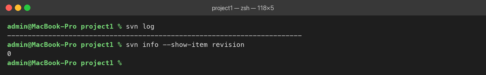

# Отчёт по лабораторному практикуму № 2

**Дисциплина:** Системы управления версиями  
**Тема:** Классификация и сравнение систем управления версиями  
**Выполнил:** Осипов Даниил Сергеевич, гр. ОVМП-103ивс  
**Преподаватель:** Дмитриев Д.В.

> Полный отчёт с титульным листом — [Осипов_ДС_ЛП2.docx](Осипов_ДС_ЛП2.docx) (PDF: [Осипов_ДС_ЛП2.pdf](Осипов_ДС_ЛП2.pdf)). Сдан в ЛМС МТИ 05.10.2026.
> Изображения окна терминала в папке [Скриншоты](Скриншоты/) построены по реальному выводу команд; полный журнал команд с выводом и временем выполнения — [terminal_log.json](Скриншоты/terminal_log.json).

## 1. Цель работы

Освоить классификацию СУВ (локальные, централизованные, распределённые), получить практический опыт работы с централизованной (SVN) и распределённой (Git) системами и сравнить их по критериям удобства, скорости и надёжности.

Среда: macOS 26.6 (Apple Silicon), zsh, Git 2.54.0, Subversion 1.14.5 (`brew install subversion`).

## 2. Сравнение архитектур (Этап 1)

| Критерий | Централизованная (SVN) | Распределённая (Git) |
|---|---|---|
| Где хранится каноническая история | На центральном сервере; рабочая копия содержит файлы текущей ревизии и метаданные `.svn` | В каждом клоне (`.git`); «каноническим» по соглашению считается удалённый репозиторий |
| Работа без сети | Редактирование, `svn status`, `svn diff`; commit, update, log, ветки — только с сервером | Коммиты, история, diff, ветки, слияния; сеть нужна только для push/pull/fetch |
| Создание веток | Серверная операция `svn copy` в `branches/`, новая ревизия | Локальный лёгкий указатель на коммит (`git switch -c`) |
| Крупные бинарные файлы | Удобнее: нет полной истории в копии, есть блокировки `svn lock` | Репозиторий растёт; применяют Git LFS, shallow/partial clone, Perforce |
| Типичные сценарии | Legacy, права по каталогам, бинарные ассеты с блокировками | Исходный код любого масштаба, open source, DevOps, встраиваемое ПО |

## 3. Выполнение (Этапы 2–3)

### SVN

| Шаг | Команды | Скриншот |
|---|---|---|
| Репозиторий и первая рабочая копия | `svnadmin create repo`, `svn checkout file://…/repo project1` | [svn1](Скриншоты/shot_svn1.png) |
| readme.txt «Hello SVN», первый коммит (r1) | `svn add`, `svn commit -m "Initial commit"` | [svn2](Скриншоты/shot_svn2.png) |
| Вторая строка, второй коммит (r2) | `svn diff`, `svn commit` | [svn3](Скриншоты/shot_svn3.png) |
| История в первой папке | `svn log` → пусто, папка на ревизии 0 | [svn4](Скриншоты/shot_svn4.png) |
| Вторая рабочая копия | `svn checkout … project2`, `svn log` → r2, r1 | [svn5](Скриншоты/shot_svn5.png) |
| Синхронизация первой папки | `svn update`, `svn log` → r2, r1 | [svn6](Скриншоты/shot_svn6.png) |

**Чего не хватает в первой папке.** После `svn commit` номер ревизии обновляется только у отправленного файла, а каталог остаётся на прежней ревизии (смешанная рабочая копия). `svn log` показывает историю до ревизии рабочей копии, поэтому r1 и r2 не видны. История хранится на сервере — чтобы её увидеть, нужен `svn update`.

### Git

| Шаг | Команды | Скриншот |
|---|---|---|
| Bare-репозиторий и клон | `git init --bare repo.git`, `git clone repo.git project1` | [git1](Скриншоты/shot_git1.png) |
| readme.txt «Hello Git», первый коммит | `git add .`, `git commit -m "Initial commit"` | [git2](Скриншоты/shot_git2.png) |
| Вторая строка, второй коммит | `git diff`, `git commit -am …` | [git3](Скриншоты/shot_git3.png) |
| История | `git log`, `git log --oneline --graph` | [git4](Скриншоты/shot_git4.png) |
| Публикация | `git push origin HEAD` | [git5](Скриншоты/shot_git5.png) |
| Второй клон | `git clone repo.git project2`, `git log --oneline` | [git6](Скриншоты/shot_git6.png) |

В Git история хранится в каждом клоне, поэтому `git log` в обеих папках показывает одно и то же без дополнительной синхронизации.

### Дополнительные проверки

- Ветка в Git — `git switch -c feature/docs`, мгновенно и локально ([git7](Скриншоты/shot_git7.png)); в SVN — `svn mkdir branches` + `svn copy`, каждая операция — новая ревизия ([svn7](Скриншоты/shot_svn7.png)).
- Недоступный репозиторий (имитация переименованием): SVN — ошибка E170013 ([svn8](Скриншоты/shot_svn8.png)); Git — коммит выполняется локально ([git8](Скриншоты/shot_git8.png)).

## 4. Итоговая сравнительная таблица (Этап 4)

| Критерий | SVN | Git | Впечатления |
|---|---|---|---|
| Сложность установки | Отдельная установка через Homebrew | Уже есть в Xcode Command Line Tools | Git доступен «из коробки» |
| Скорость (commit, log) | commit ≈ 0,9 с, checkout/update ≈ 0,7–1,0 с, log ≈ 0,03 с | commit ≈ 0,04 с, log ≈ 0,03 с, push ≈ 0,1 с | Для человека разница мала, но Git-коммит в ~20 раз быстрее — он локальный |
| Удобство веток | Копия каталога на сервере, структура trunk/branches/tags | Одна команда, мгновенно | В Git ветками пользуешься постоянно |
| Работа без интернета | Нельзя коммитить, обновляться, смотреть серверную историю | Всё, кроме push/pull | Git удобен в дороге и при сбоях сервера |
| Сообщения об ошибках | Коды E170013/E180001, URL с кириллицей в %-кодировке | Подробные, с подсказками | Git дружелюбнее новичку |

## 5. Обоснование выбора СУВ для сценариев

- **Ядро ОС, 100 разработчиков в разных часовых поясах** → Git: автономная работа и локальные коммиты, лёгкие ветки и слияния с review, полная история в каждом клоне и иерархия мейнтейнеров (как в Linux).
- **Мобильная игра, C#, 50 ГБ ассетов, 10 человек** → Git для кода + Git LFS с блокировками (`git lfs lock`) для ассетов. SVN — если команда уже на нём; Perforce Helix Core — при росте ассетов до сотен ГБ.

## 6. Выводы

В SVN история хранится на сервере: первая рабочая копия «не видела» историю до `svn update`, а без доступа к репозиторию работа остановилась. В Git каждый клон содержит полную историю, коммиты и ветки создаются локально, сервер нужен только для обмена. Для личного использования удобнее Git; SVN или Perforce уместны при большом объёме несливаемых бинарных файлов, правах по каталогам и в legacy-проектах.
